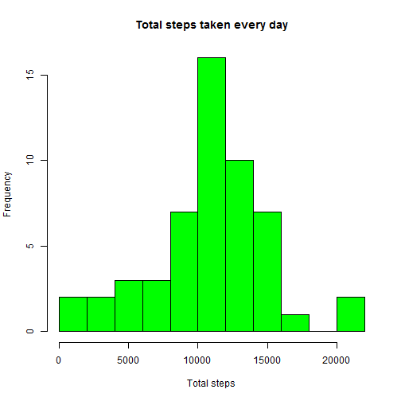
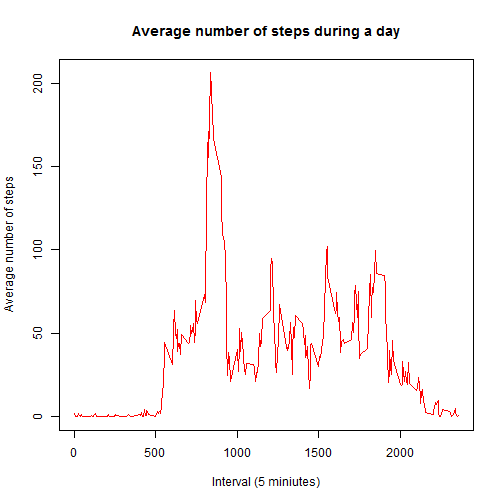
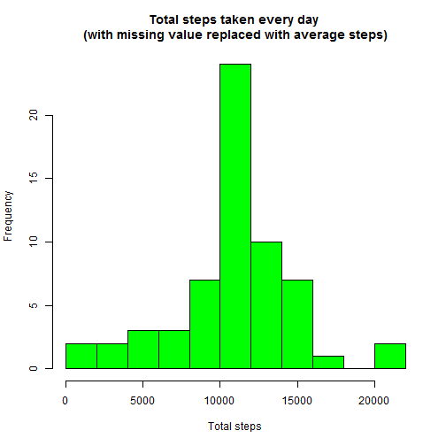
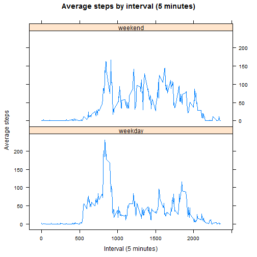

## Loading and preprocessing the data


```r
suppressMessages(library(dplyr))
df <- read.csv("activity.csv")
# convert date field from factor to Date
df$date <- as.POSIXct(df$date, format="%Y-%m-%d")
```

## What is mean total number of steps taken per day?

Calculate the total number of steps taken every day.


```r
q1 <- group_by(df, date) %>%
    summarize(total = sum(steps))
head(q1)
```

```
## Source: local data frame [6 x 2]
## 
##         date total
##       (time) (int)
## 1 2012-10-01    NA
## 2 2012-10-02   126
## 3 2012-10-03 11352
## 4 2012-10-04 12116
## 5 2012-10-05 13294
## 6 2012-10-06 15420
```

```r
hist(q1$total, 
     breaks = 10,
     col = "green",
     xlab = "Total steps", 
     ylab = "Frequency", 
     main = "Total steps taken every day")
```

 

Calculate the mean/median of the steps taken everyday.


```r
round(mean(q1$total, na.rm = TRUE), 0)
```

```
## [1] 10766
```

```r
median(q1$total, na.rm = TRUE)
```

```
## [1] 10765
```
The mean of the steps taken everyday is **1.0766 &times; 10<sup>4</sup>**, and the median is **10765**


## What is the average daily activity pattern?

Time series plot of the average number of steps taken


```r
# remove the N/A data
cleandata <- filter(df, !is.na(steps))
# cacculate average number of steps group by interval
avg_step <- summarize(group_by(cleandata, interval), step=mean(steps))
plot(avg_step$interval, avg_step$step, 
     type = "l",
     col = "red", 
     xlab = "Interval (5 miniutes)", 
     ylab = "Average number of steps", 
     main = "Average number of steps during a day")
```

 

The 5-minute interval that, on average, contains the maximum number of steps


```r
# find the row number which contains the max steps
maxidx <- which.max(avg_step$step)
# get the interval of the max steps
avg_step[maxidx,]$interval
```

```
## [1] 835
```
Max steps is **206**, which happens on interval **835**

## Imputing missing values

Calculate and report the total number of missing values in the dataset (i.e. the total number of rows with NAs)


```r
# Calculate total number of NA for each column
colSums(is.na(df))
```

```
##    steps     date interval 
##     2304        0        0
```

Only **steps** column has NA, it has **2304** NA values.

Fill in all of the missing values in the dataset. The strategy is to use the the mean for that 5-minute interval.


```r
# get rownames for all NA rows
na_rows <- rownames(df[is.na(df$steps),])
```


Create a new dataset that is equal to the original dataset but with the missing data filled in.


```r
# duplicate the original dataset
df_new <- df
for(i in na_rows){
    # get the interval value in this NA row
    intvl <- df_new[i,"interval"]
    # replace the NA with average steps calculated before
    df_new[i,"steps"] <- round(avg_step[avg_step$interval == intvl, "step"],0)
}
```

Here is the summary of original dataset


```r
summary(df)
```

```
##      steps             date               interval     
##  Min.   :  0.00   Min.   :2012-10-01   Min.   :   0.0  
##  1st Qu.:  0.00   1st Qu.:2012-10-16   1st Qu.: 588.8  
##  Median :  0.00   Median :2012-10-31   Median :1177.5  
##  Mean   : 37.38   Mean   :2012-10-31   Mean   :1177.5  
##  3rd Qu.: 12.00   3rd Qu.:2012-11-15   3rd Qu.:1766.2  
##  Max.   :806.00   Max.   :2012-11-30   Max.   :2355.0  
##  NA's   :2304
```


And here is the summary of new dataset with NA value replaced with mean value


```r
summary(df_new)
```

```
##      steps             date               interval     
##  Min.   :  0.00   Min.   :2012-10-01   Min.   :   0.0  
##  1st Qu.:  0.00   1st Qu.:2012-10-16   1st Qu.: 588.8  
##  Median :  0.00   Median :2012-10-31   Median :1177.5  
##  Mean   : 37.38   Mean   :2012-10-31   Mean   :1177.5  
##  3rd Qu.: 27.00   3rd Qu.:2012-11-15   3rd Qu.:1766.2  
##  Max.   :806.00   Max.   :2012-11-30   Max.   :2355.0
```


Make a histogram of the total number of steps taken each day and Calculate and report the mean and median total number of steps taken per day. Do these values differ from the estimates from the first part of the assignment? What is the impact of imputing missing data on the estimates of the total daily number of steps?


```r
# calaulate the total steps per day on the new data set
total_steps_new <- group_by(df_new, date) %>%
    summarize(total = sum(steps))
# show first 6 rows
head(total_steps_new)
```

```
## Source: local data frame [6 x 2]
## 
##         date total
##       (time) (dbl)
## 1 2012-10-01 10762
## 2 2012-10-02   126
## 3 2012-10-03 11352
## 4 2012-10-04 12116
## 5 2012-10-05 13294
## 6 2012-10-06 15420
```

```r
hist(total_steps_new$total,
     breaks = 10,
     col = "green",
     xlab = "Total steps", 
     ylab = "Frequency", 
     main = "Total steps taken every day \n(with missing value replaced with average steps)")
```

 

Calculate the mean and median total number of steps on the new data set.


```r
round(mean(total_steps_new$total), 0)
```

```
## [1] 10766
```

```r
median(total_steps_new$total)
```

```
## [1] 10762
```

The mean of total number of steps on the new data set is **1.0766 &times; 10<sup>4</sup>** and median number is **1.0762 &times; 10<sup>4</sup>**. 

The differenc is not significant comparing the part 1 calculation because:

1. The part 1 calculation did not include the interval with missing step data
2. We replace the missing data with the average steps of the interval

Conclusion is imputing missing value with mean data of the interval is a good choice and it will not bring significant impact to the data set.


## Are there differences in activity patterns between weekdays and weekends?

Create a new factor variable in the dataset with two levels ¨C "weekday" and "weekend" indicating whether a given date is a weekday or weekend day.


```r
# add weekday and weekend column
df_new <- mutate(df_new, 
                 weekday = weekdays(date),
                 weekend = ifelse(weekday == "Saturday" | weekday == "Sunday", "weekend", "weekday"))
```


Make a panel plot containing a time series plot (i.e. type = "l") of the 5-minute interval (x-axis) and the average number of steps taken, averaged across all weekday days or weekend days (y-axis).


```r
# calculate average of steps group by interval and weekend
avg_step_by_weekend <- summarize(group_by(df_new, interval, weekend), avg = mean(steps))
# use lattice to plot
library(lattice)
xyplot(avg_step_by_weekend$avg ~ avg_step_by_weekend$interval | avg_step_by_weekend$weekend, 
       type = "l",
       layout = c(1, 2), 
       xlab = "Interval (5 minutes)", 
       ylab = "Average steps",
       main = "Average steps by interval (5 minutes)")
```

 

Updated on 2016-01-11 02:48:43
